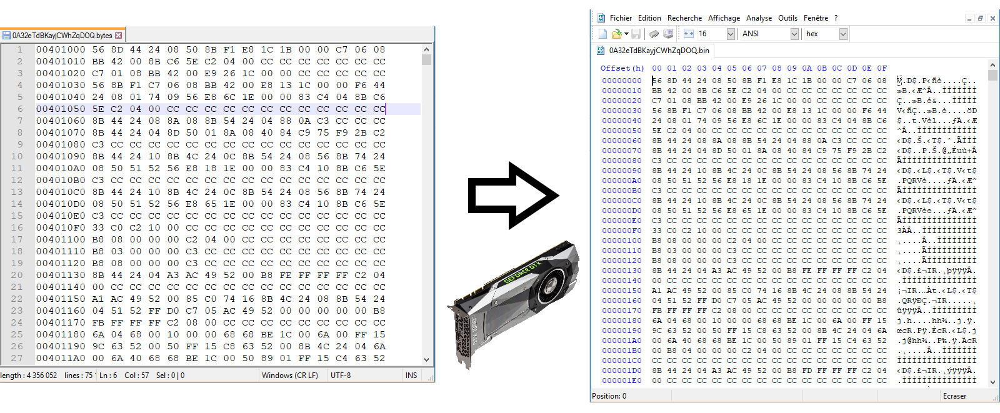

# Hex2Bin
Convert large hexadecimal file to binary file using GPU. 



#### Requirements

* Visual Studio Community 2017

* CUDA 10.0

  

#### Usage

```
C:> Hex2Bin.exe
Usage: Hex2Bin.exe <hexadecimal input file> <output file>
```

